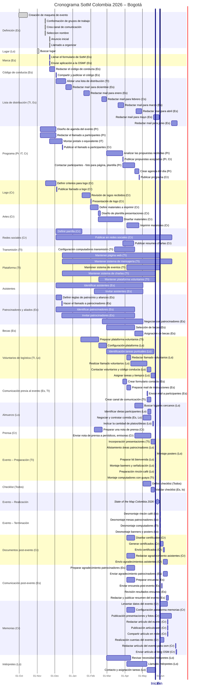

```mermaid
gantt
    title Cronograma SotM Colombia 2026 – Bogotá
    dateFormat  YYYY-MM-DD
    axisFormat  %d-%b
    
    section Definición (Es)
    Creación de maqueta de evento            :done, 2025-09-30, 15d
    Conformación de grupos de trabajo        :done, 2025-11-14, 1d
    Crea canal de comunicación               :done, 2025-11-14, 1d
    Seleccion nombre                         :done, 2025-11-14, 1d
    Anuncio inicial                          :done, 2025-11-22, 1d
    Llamado a organizar                      :done, 2025-11-22, 1d
    
    section Lugar (Lo)
    Buscar lugar                             :done, 2025-11-01, 3d
    
    section Marca (Es)
    Llenar el formulario de SotM (Es)        :2025-11-22, 1d
    Enviar aplicación a la OSMF (Es)         :2025-11-22, 1d

    section Código de conducta (Es)
    Redactar el código de conducta (Es)      :2025-11-22, 2025-12-01
    Compartir y publciar el código (Es)      :2025-12-03, 1d
    
    section Lista de distribución (TI, Es)
    Alistar una lista de distribución (TI)   :2025-12-03, 2025-12-20
    Redactar mail para diciembre (Es)        :2025-12-20, 2025-12-30
    Redactar mail para enero (Es)            :2026-01-20, 2026-01-30
    Redactar mail para febrero (Es)          :2026-02-20, 2026-02-28
    Redactar mail para marzo (Es)            :2026-03-20, 2026-03-30
    Redactar mail para abril (Es)            :2026-04-20, 2026-04-30
    Redactar mail para mayo (Es)             :2026-05-20, 2026-05-30
    Redactar mail para junio (Es)            :2026-06-20, 2026-06-30

    section Programa (Pr, IT, Cr)
    Diseño de agenda del evento (Pr)         :2025-11-06, 2025-12-03
    Redactar el llamado a participantes (Pr) :2025-11-06, 2025-12-03
    Montar pretalx o equivalente (IT)        :2025-11-22, 2025-12-14
    Publicar el llamado a participantes (Cr) :2025-12-14, 1d
    Analizar las propuestas recibidas (Pr)   :2026-02-28, 2026-03-28
    Publicar propuestas aceptadas (Pr, Cr)   :2026-03-28, 1d
    Contactar participantes - foto para página, plantilla (Pr)      :2026-03-28, 2026-04-18
    Crear agenda del día (Pr)                :2026-04-18, 2026-04-25
    Publicar programa (Cr)                   :2026-04-25, 1d

    section Logo (Cr)
    Definir criterios para logo (Cr)         :2025-11-15, 2025-12-03
    Publicar llamado a logo (Cr)             :2025-12-04, 1d
    Revisión de logos recibidos (Cr)         :2026-01-17, 2026-01-31
    Presentación de logo (Cr)                :2026-02-01, 1d
    
    section Artes (Cr)
    Definir materiales a imprimir (Cr)       :2026-01-31, 2026-02-14
    Diseño de plantilla presentaciones (Cr)  :2026-02-14, 2026-02-18
    Diseñar materiales (Cr)                  :2026-02-14, 2026-03-28
    Imprimir materiales (Cr)                 :2026-04-04, 2026-04-25
    
    section Redes sociales (Cr)
    Definir parrilla (Cr)                    :2025-12-03, 2026-01-17
    Publicar en redes sociales (Cr)          :2025-12-03, 2026-06-21
    Publicar resumen charlas (Cr)            :2026-03-28, 2026-04-16
    
    section Transmisión (TI)
    Configuración computadores transmisión (TI) :2026-03-14, 2026-04-18
    
    section Plataforma (TI)
    Mantener página web (TI)                 :2025-12-14, 2026-05-31
    Mantener sistema de mensajería (TI)      :2025-12-14, 2026-06-21
    Mantener sistema de eventos (TI)         :2026-04-04, 2026-05-31
    Mantener sistema de charlas (TI)         :2025-12-14, 2026-05-23
    Mantener plataforma voluntarios (TI)     :2026-02-15, 2026-05-23

    section Asistentes
    Identificar asistentes (Es)              :2025-12-03, 2026-05-02
    Invitar asistentes (Es)                  :2026-02-07, 2026-05-02

    section Patrocinadores y aliados (Es)
    Definir reglas de patrocinio y alianzas (Es) :2025-12-03, 2025-12-13
    Hacer el llamado a patrocinadores (Es)   :2025-12-13, 1d
    Identificar patrocinadores (Es)          :2025-12-03, 2026-04-18
    Invitar patrocinadores (Es)              :2025-12-13, 2026-04-18
    Negociar con patrocinadores (Es)         :2026-02-21, 2026-05-02

    section Becas (Es)
    Selección de becas (Es)                  :2026-02-28, 2026-04-18
    Asignación de becas (Es)                 :2026-04-18, 2026-05-02

    section Voluntarios de logística (TI, Lo)
    Preparar plataforma voluntarios (TI)     :2026-01-15, 2026-02-15
    Configuración plataforma (Lo)            :2026-02-15, 2026-02-28
    Identificación tareas puntuales (Lo)     :2026-02-28, 2026-05-21
    Redactar llamado voluntarios (Lo)        :2026-04-04, 2026-04-11
    Realizar llamado voluntarios (Lo)        :2026-04-11, 2026-05-09
    Contactar voluntarios y código conducta (Lo) :2026-05-09, 2026-05-16
    Asignar tareas y tiempos       (Lo)      :2026-05-16, 2026-05-23

    section Comunicación previa al evento (Es, TI)
    Crear formulario contacto (Es)           :2026-03-28, 2026-04-04
    Preparar mail de instrucciones (Es)      :2026-04-04, 2026-04-11
    Enviar mail a participantes (Es)         :2026-05-09, 1d
    Crear canal de comunicación (TI)         :2026-05-09, 2026-05-16

    section Almuerzo (Lo)
    Buscar lugares cercanos (Lo)             :2026-04-18, 2026-05-02
    Identificar dietas participantes (Lo)    :2026-05-10, 2026-05-16
    Negociar y contratar comida (Es, Lo)     :2026-05-02, 2026-05-16
    Indicar la cantidad de platos/dietas (Lo) :2026-05-19, 2026-05-20
    
    section Prensa (Cr)
    Preparar una nota de prensa (Cr)         :2026-02-07, 2026-02-21
    Enviar nota de prensa a periódicos, emisoras (Cr) :2026-04-18, 2026-05-16

    section Evento – Preparación (TI)
    Incorporación presentaciones (TI)        :2026-05-16, 2026-05-23
    Alistamiento áreas patrocinadores (Lo)   :2026-05-23, 1d
    Montaje posters (Lo)                     :2026-05-23, 1d
    Preparar kit bienvenida (Lo)             :2026-05-23, 1d
    Montaje banners y señalización (Lo)      :2026-05-23, 1d
    Preparación rincón café (Lo)             :2026-05-23, 1d
    Montaje computadores con guaya (TI)      :2026-05-23, 2026-05-24

    section Checklist (Todos)
    Definir checklist (Todos)                :2026-05-02, 2026-05-16
    Validar checklist (Es, lo)               :2026-05-16, 2026-05-22

    %% Hasta aquí toda la preparación del evento
    
    section Evento – Realización
    Inicio : vert, 2026-05-23,1d
    State of the Map Colombia 2026           :milestone, 2026-05-23, 2026-05-31
    Fin : vert, 2026-05-31,1d

    %% Evento terminado
    
    section Evento – Terminación
    Desmontaje rincón café (Lo)              :2026-05-31, 1d
    Desmontaje mesas patrocinadores (Lo)     :2026-05-31, 1d
    Desmontaje computadores (TI)             :2026-05-31, 1d
    Desmontaje banners y posters (Lo)        :2026-05-31, 1d

    section Documentos post-evento (Cr)
    Diseñar certificados (Cr)                :2026-04-04, 2026-04-18
    Generar certificados (Cr)                :2026-06-01, 2026-06-06
    Envío certificados (Cr)                  :2026-06-06, 2026-06-08
    Redactar agradecimiento asistentes (Cr)  :2026-04-04, 2026-04-18
    Envío agradecimientos asistentes (Cr)    :2026-06-06, 2026-06-13

    section Comunicación post-evento (Es)
    Preparar agradecimiento patrocinadores (Es) :2026-04-04, 2026-04-18
    Enviar agradecimiento patrocinadores (Es)  :2026-06-06, 2026-06-13
    Preparar encuesta (Es)                   :2026-04-04, 2026-04-18
    Enviar encuesta post-evento (Es)         :2026-06-03, 1d
    Revisión resultados encuesta (Es)        :2026-06-13, 2026-06-13
    Redactar y publicar resumen del evento (Es) :2026-06-11, 2026-06-15

    section Memorias (Cr)
    Levantar datos del evento  (Cr)          :2026-05-31, 2026-06-13
    Configuración plataforma memorias  (Cr)  :2026-04-04, 2026-04-18
    Publicación presentaciones y fotos  (Cr) :2026-06-01, 2026-06-20
    Redactar artículo del evento  (Cr)       :2026-06-13, 1d
    Publicación artículo web  (Cr)           :2026-06-13, 1d
    Compartir artículo en redes  (Cr)        :2026-06-13, 1d
    Realización cuentas del evento  (Cr)     :2026-05-31, 2026-06-07
    Redactar artículo del evento para osm  (Cr) :2026-06-27, 2026-06-28
    Enviar artículo al blog OSM  (Cr)        :2026-06-28, 1d

    section Intérpretes (Lo)
    Revisar necesidad intérpretes  (Lo)      :2026-02-28, 2026-04-11
    Llamado intérpretes  (Lo)                :2026-04-04, 2026-05-09
    Contacto y asignación tareas  (Lo)       :2026-05-09, 2026-05-24


```
