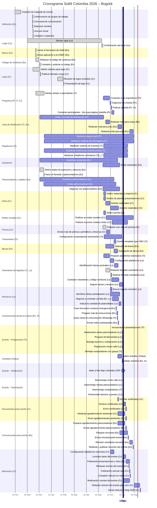

```mermaid
gantt
    title Cronograma SotM Colombia 2026 – Bogotá
    dateFormat  YYYY-MM-DD
    axisFormat  %d-%b
    
    section Definición (Es)
    Creación de maqueta de evento            :done, 2025-09-30, 15d
    Conformación de grupos de trabajo        :done, 2025-11-14, 1d
    Crea canal de comunicación               :done, 2025-11-14, 1d
    Seleccion nombre                         :done, 2025-11-14, 1d
    Anuncio inicial                          :done, 2025-11-15, 1d
    Llamado a organizar                      :done, 2025-11-15, 1d
    
    section Lugar (Lo)
    Buscar lugar (Lo)                        :done, 2025-11-01, 2026-05-10
    Confirmación del lugar (Lo)              :done, 2026-05-10, 2026-05-13
    
    section Marca (Es)
    Llenar el formulario de SotM (Es)        :done, 2025-11-22, 1d
    Enviar aplicación a la OSMF (Es)         :done, 2025-11-22, 1d

    section Código de conducta (Es)
    Redactar el código de conducta (Es)      :done, 2025-11-22, 2025-12-01
    Compartir y publciar el código (Es)      :done, 2025-12-03, 1d
    
    section Logo (Cr)
    Definir criterios para logo (Cr)         :done, 2025-11-15, 2025-12-03
    Publicar llamado a logo (Cr)             :done, 2025-12-04, 1d
    Revisión de logos recibidos (Cr)         :done, 2026-01-17, 2026-01-31
    Presentación de logo (Cr)                :done, 2026-02-01, 1d
    
    section Programa (Pr, IT, Cr)
    Diseño de agenda del evento (Pr)         :done, 2025-11-06, 2025-05-20
    Montar pretalx o equivalente (IT)        :done, 2025-11-22, 2025-12-14
    Contactar a los expositores (Pr)         :2026-05-14, 2026-05-30
    Organizar las charlas (Pr)               :2026-05-31, 2026-06-02
    Publicar agenda (Pr, Cr)   :2026-06-03, 1d
    Contactar participantes - foto para página, plantilla (Pr)      :2026-06-04, 2026-06-10

    section Lista de distribución (TI, Es)
    Alistar una lista de distribución (TI)   :2025-12-03, 2026-05-15
    Redactar mail para mayo (Es)             :2026-05-20, 2026-05-30
    Redactar mail para junio (Es)            :2026-06-20, 2026-06-30
    Redactar mail para julio (Es)            :2026-07-20, 2026-07-30

    section Plataforma (TI)
    Mantener página web (TI)                 :2025-12-14, 2026-07-31
    Mantener sistema de mensajería (TI)      :2025-12-14, 2026-07-31
    Mantener sistema de eventos (TI)         :2026-05-15, 2026-07-15
    Mantener sistema de charlas-pretalx (TI) :2025-12-14, 2026-07-15
    Mantener plataforma voluntarios (TI) ¿?  :2026-05-15, 2026-07-15

    section Asistentes
    Identificar asistentes (Es)              :2025-12-03, 2026-06-20
    Invitar asistentes (Es)                  :2026-05-13, 2026-06-25

    section Patrocinadores y aliados (Es)
    Definir reglas de patrocinio y alianzas (Es) :done, 2025-12-03, 2025-12-13
    Hacer el llamado a patrocinadores (Es)   :done, 2025-12-13, 1d
    Identificar patrocinadores (Es)          :2025-12-03, 2026-06-10
    Invitar patrocinadores (Es)              :2025-12-13, 2026-06-15
    Negociar con patrocinadores (Es)         :2026-05-13, 2026-06-25

    section Artes (Cr)
    Definir materiales a imprimir (Cr)       :2026-05-15, 2026-05-20
    Diseño de plantilla presentaciones (Cr)  :2026-05-15, 2026-05-20
    Diseñar materiales (Cr)                  :2026-05-20, 2026-05-31
    Imprimir materiales (Cr)                 :2026-06-01, 2026-06-22
    
    section Redes sociales (Cr)
    Definir parrilla (Cr)                    :2026-05-15, 2026-05-20
    Publicar en redes sociales (Cr)          :2026-05-21, 2026-07-30
    Publicar resumen charlas-invitar (Cr)    :2026-06-05, 2026-07-15
    
    section Prensa (Cr)
    Preparar una nota de prensa (Cr)         :done, 2026-05-13, 2026-05-21
    Enviar nota de prensa a periódicos, emisoras (Cr) :2026-05-22, 2026-05-30

    section Transmisión (TI)
    Configuración computadores transmisión (TI) :2026-05-16, 2026-06-30
    Diseñar template para OBX (TI)           :2026-06-10, 2026-06-15
    
    section Becas (Es)
    Selección de becas (Es)                  :2026-05-20, 2026-06-10
    Asignación de becas (Es)                 :2026-06-10, 2026-06-20

    section Voluntarios de logística (TI, Lo)
    Preparar plataforma voluntarios (TI)     :2026-05-15, 2026-05-30
    Configuración plataforma (Lo)            :2026-05-31, 2026-06-10
    Identificación tareas puntuales (Lo)     :2026-06-11, 2026-06-21
    Redactar llamado voluntarios (Lo)        :done, 2026-05-20, 2026-05-30
    Realizar llamado voluntarios (Lo)        :2026-06-03, 1d
    Contactar voluntarios y código conducta (Lo) :2026-06-04, 2026-06-23
    Asignar tareas y tiempos       (Lo)      :2026-06-24, 2026-07-02

    section Almuerzo (Lo)
    Buscar lugares cercanos (Lo)             :2026-06-01, 2026-06-05
    Identificar dietas participantes (Lo)    :2026-06-01, 2026-06-25
    Negociar y contratar comida (Es, Lo)     :2026-06-06, 2026-06-22
    Indicar la cantidad de platos/dietas (Lo) :2026-06-23, 2026-06-28
    
    section Comunicación previa al evento (Es, TI)
    Crear formulario contacto emergencia (Es) :2026-06-15, 2026-06-16
    Preparar mail de instrucciones (Es)      :2026-06-17, 2026-06-20
    Crear canal de comunicación WhatsApp (TI) :2026-06-19, 1d
    Enviar mail a participantes (Es)         :2026-06-21, 1d

    section Evento – Preparación (TI)
    Incorporación presentaciones (TI)        :2026-06-25, 2026-06-02
    Alistamiento áreas patrocinadores (Lo)   :2026-07-02, 1d
    Preparar kit bienvenida (Lo)             :2026-07-02, 1d
    Montaje banners y señalización (Lo)      :2026-07-02, 1d
    Preparación rincón café (Lo)             :2026-07-02, 1d
    Montaje computadores con guaya (TI)      :2026-07-03, 2026-07-04

    section Checklist (Todos)
    Definir checklist (Todos)                :2026-06-20, 2026-06-30
    Validar checklist (Es, lo)               :2026-07-01, 2026-07-02

    %% Hasta aquí toda la preparación del evento
    
    section Evento – Realización
    Inicio : vert, 2026-07-03,1d
    State of the Map Colombia 2026           :milestone, 2026-07-03, 2026-07-04
    Fin : vert, 2026-07-04,1d

    %% Evento terminado
    
    section Evento – Terminación
    Desmontaje rincón café (Lo)              :2026-07-04, 1d
    Desmontaje mesas patrocinadores (Lo)     :2026-07-04, 1d
    Desmontaje computadores (TI)             :2026-07-04, 1d
    Desmontaje banners y posters (Lo)        :2026-07-04, 1d

    section Documentos post-evento (Cr)
    Diseñar certificados (Cr)                :2026-06-20, 2d
    Generar certificados (Cr)                :2026-07-05, 5d
    Envío certificados (Cr)                  :2026-07-10, 2d
    Redactar agradecimiento asistentes (Cr)  :2026-06-20, 2026-07-08
    Envío agradecimientos asistentes (Cr)    :2026-07-10, 2d

    section Comunicación post-evento (Es)
    Preparar agradecimiento patrocinadores (Es) :2026-06-20, 2026-07-08
    Enviar agradecimiento patrocinadores (Es)  :2026-07-10, 2d
    Preparar encuesta (Es)                   :2026-06-25, 2026-07-15
    Enviar encuesta post-evento (Es)         :2026-07-16, 1d
    Revisión resultados encuesta (Es)        :2026-07-20, 2026-07-28
    Redactar y publicar resumen del evento (Es) :2026-07-29, 2026-07-30

    section Memorias (Cr)
    Configuración plataforma memorias  (Cr)  :2026-06-01, 2026-06-10
    Levantar datos del evento  (Cr)          :2026-07-03, 2026-07-10
    Publicación presentaciones y fotos  (Cr) :2026-07-11, 2026-07-20
    Redactar artículo del evento  (Cr)       :2026-07-18, 1d
    Publicación artículo web  (Cr)           :2026-07-20, 1d
    Compartir artículo en redes  (Cr)        :2026-07-21, 1d
    Realización cuentas del evento  (Cr)     :2026-07-03, 2026-07-20
    Redactar artículo del evento para osm  (Cr) :2026-08-01, 2026-08-15
    Enviar artículo al blog OSM  (Cr)        :2026-08-16, 1d
```
